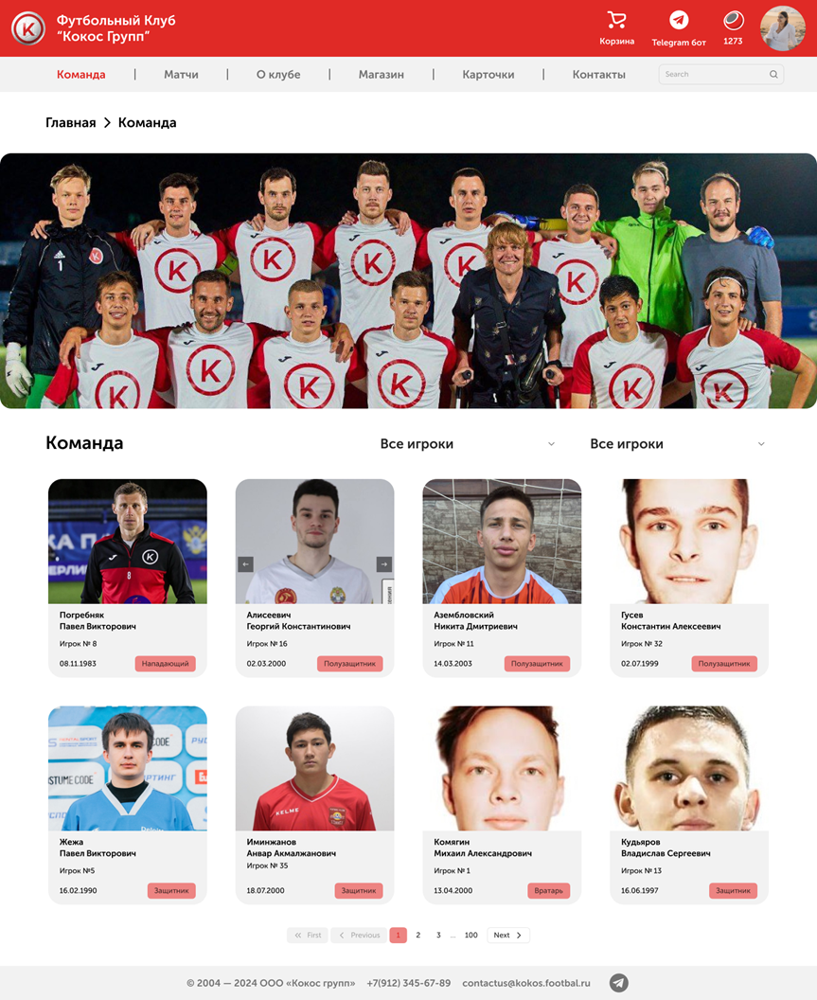
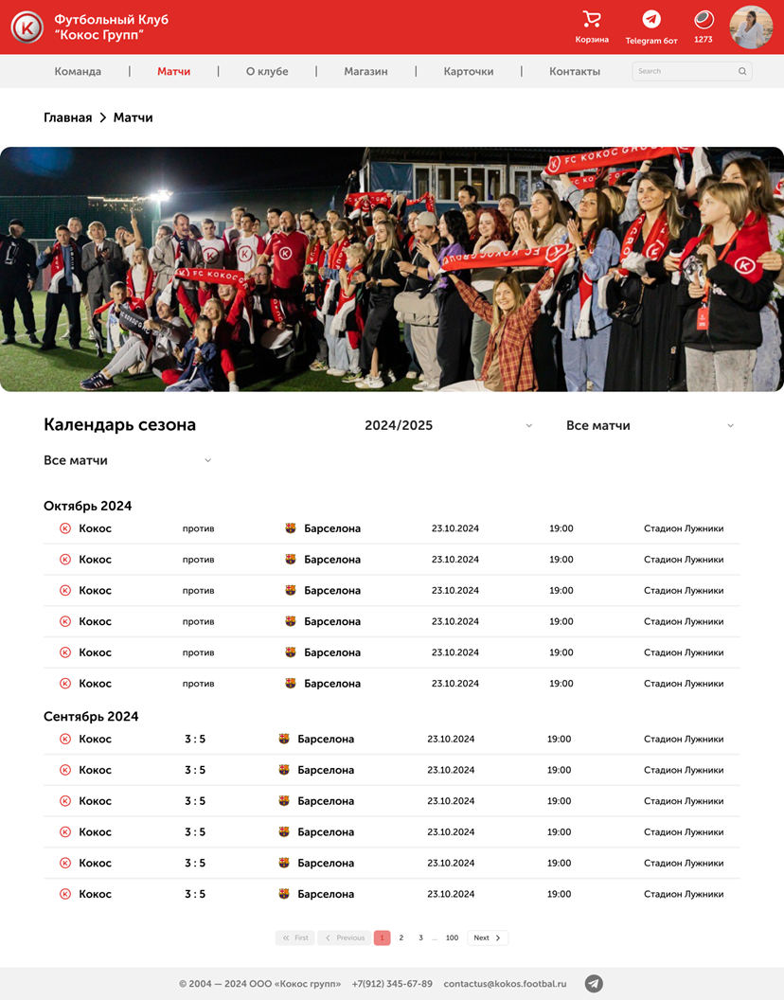
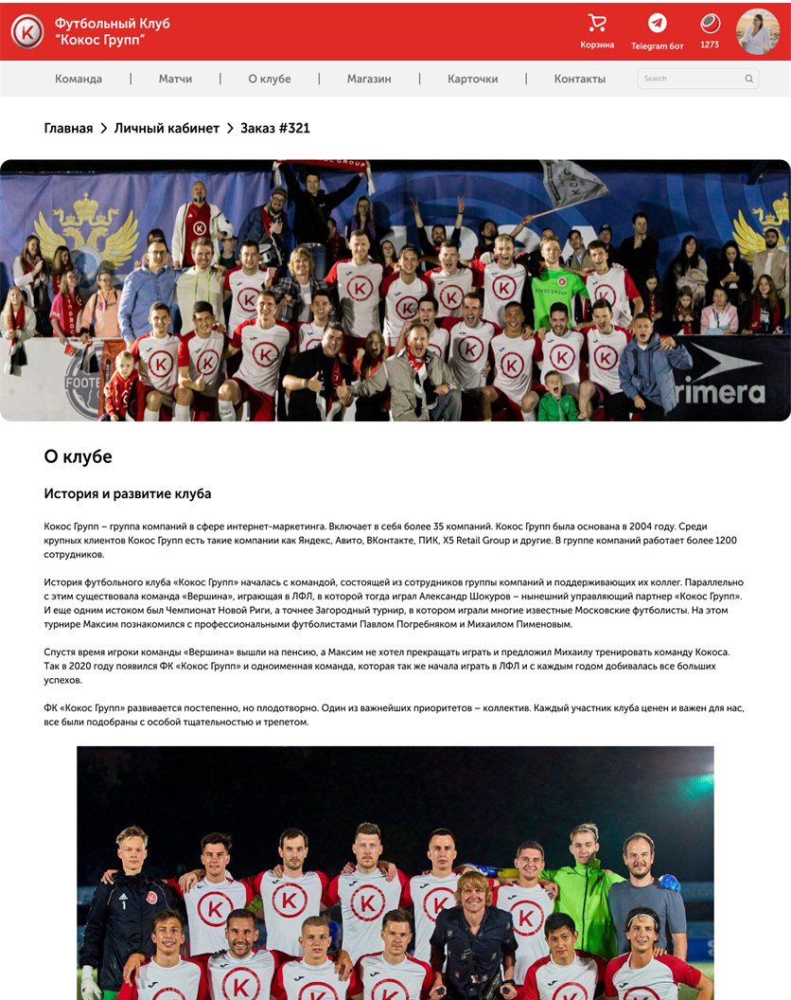
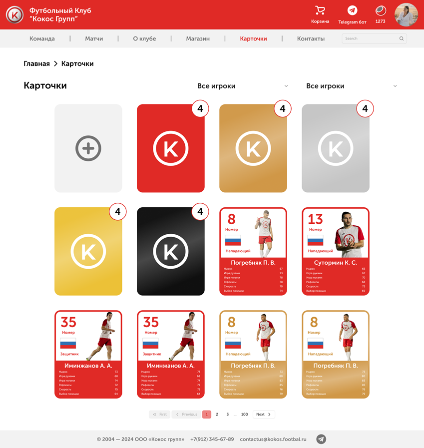
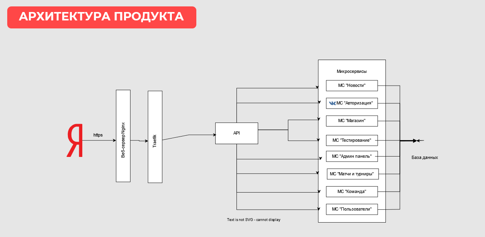
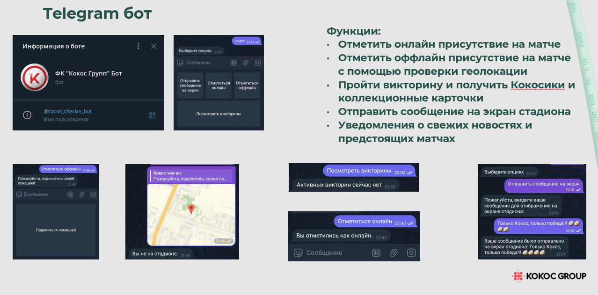
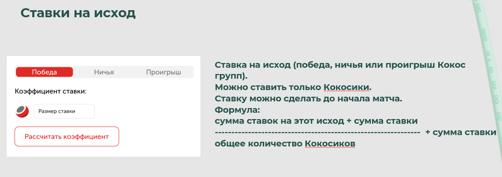

# Кокос Hackathon 2024

**_MISIS x BGITU_**

Team Members:

1. **Виктория Гайлитис** - Backend
2. **Дмитрий Коноплянников** - Backend
3. **Ильдар Ишбулатов** - Design
4. **Дарья Короленко** - Frontend
5. **Борис** - Frontend

Презентация:

Веб-сервис:

Swagger API docs:

## Кейс "Веб-платформа для футбольного клуба"

> Разработай платформу, которая объединит игроков и болельщиков ФК «Кокос Групп». А также, предоставит болельщикам возможность следить за новостями любимой команды: календарь игр и турниров, информация об игроках, трансляции матче, а футбольному клубу увеличивать лояльных и преданных болельщиков через программы лояльности, комьюнити и т.д.

## Предложенное решение

В основу нашего сайта были заложены самые важные категории: главная страница с новостями, страница команды, страница со всеми матчами, страница с информацией о клубе, магазин и корзина, карточки (о них мы расскажем чуть позже), контакты клуба и личный кабинет.

На странице команды можно просмотреть в формате карточек всех игроков и административный персонал клуба, а также перейти на страницу игрока.

На станице матчей можно посмотреть прошедшие и предстоящие матчи, а также перейти на страницу матча.

На странице о клубе есть информация об истории и развитии клуба.

На странице магазина можно купить коллекционные карточки (о них еще чуть позже), мерч и видеопоздравление или фотосессию после матча с командой. Товары можно купить за рубли или баллы, которые называются Кокосики.

Коллекционные карточки с игроками. Их можно покупать в магазине, получать за оффлайн отметки на матче или за заказы за рубли от определенной суммы.


### Архитектура решения



### Фичи





## Запуск проекта локально с помощью docker compose

Для работы https на localhost требуется сгенерировать сертификаты. Это можно сделать с помощью скрипта:

(требуется установленная утилита [mkcert](https://github.com/FiloSottile/mkcert))

```
sh setup-local-certs.sh
```

Команда docker compose для запуска локально:

```
docker compose --env-file ./.env.dev -f ./docker-compose.dev.yml up
```
